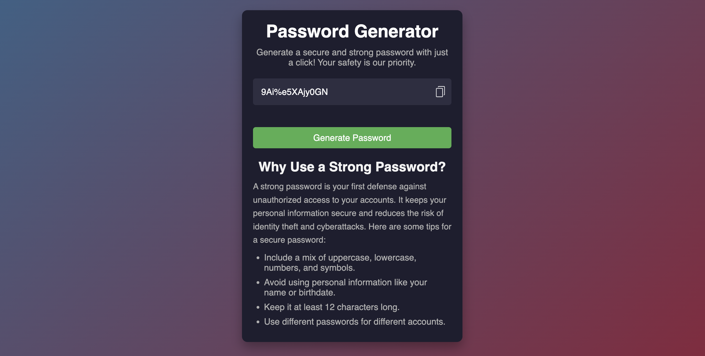

# Password Generator

## Overview
The **Password Generator** is a simple and secure web-based application that helps users generate strong passwords to protect their accounts. With a single click, you can create a random password and easily copy it for use.

---

## How to Use
1. Open the application in your browser.
2. Click the **Generate Password** button to create a new password.
3. Copy the generated password by clicking the copy icon next to the input field.
4. Use the password for your online accounts or applications.

---

## Features
- **Generate Password**: Create strong passwords instantly.
- **Copy to Clipboard**: Easily copy the password to use it anywhere.
- **Security Tips**: Learn about password best practices to keep your accounts secure.

---

## 🛠️ Technologies Used

- **HTML**: For the game structure.
- **CSS**: For styling and responsiveness.
- **JavaScript**: For game logic and interactivity.

---

## Screenshots
### 1. **Home Page**

> *The home page displays the title, a password generator button, and copy options.*

